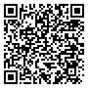

# Myrient NDS Store
A convenient NDS ROM downloading tool made with Universal-Updater.
***

## About
Myrient NDS Store is a project that allows you to download NDS ROMs from Myrient using a modded 3DS. Gone are the days of manually downloading and extracting ROMs into an SD card! This is possible thanks to [Universal-Updater](https://github.com/Universal-Team/Universal-Updater/), a tool for managing 3DS homebrew.

## Installation
You will need:
- A modded 3DS system.
- [Universal-Updater](https://github.com/Universal-Team/Universal-Updater/)
- An Internet connection.

First, open Universal-Updater, then go to **Settings** -> **Select UniStore**. After that, tap on the **Add UniStore** icon (+) and select the QR code icon on the bottom left. Then, scan this QR code to install the Myrient NDS Store Manager.

After that, select the store name (**myrient-nds-manager.unistore**). Once loaded into the interface (see below), select the stores you want and install them. Then, go to **Settings** -> **Select UniStore** and select the store you downloaded. 

> [!WARNING]
> If scanning the QR code crashes your system, try tapping on the keyboard icon instead, and input the following URL: `github.com/misperception/myrient-nds-unistore/raw/master/unistore/myrient-nds-manager.unistore`
> If everything else fails, try extracting the .zip file in the [releases](https://github.com/misperception/myrient-nds-unistore/releases/latest) section to the root of your SD file.

