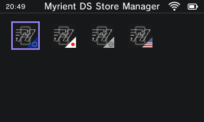
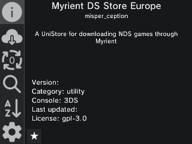

# Myrient NDS Store
A convenient NDS ROM downloading tool made with Universal-Updater.
***

## About
Myrient NDS Store is a project that allows you to download NDS ROMs from Myrient using a modded 3DS. Gone are the days of manually downloading and extracting ROMs into an SD card! This is possible thanks to [Universal-Updater](https://github.com/Universal-Team/Universal-Updater/), a tool for managing 3DS homebrew.

## Installation
You will need:
- A modded 3DS system.
- [Universal-Updater](https://github.com/Universal-Team/Universal-Updater/)
- An Internet connection.

First, open Universal-Updater, then go to **Settings** -> **Select UniStore**. After that, tap on the **Add UniStore** icon (+) and select the QR code icon on the bottom left. Then, scan this QR code to install the Myrient NDS Store Manager.

After that, select the store name (**myrient-nds-manager.unistore**). Once loaded into the interface (see below), select the stores you want and install them. Then, go to **Settings** -> **Select UniStore** and select the store you downloaded. 

> [!WARNING]
> If scanning the QR code crashes your system, try tapping on the keyboard icon instead, and input the following URL: `tinyurl.com/fhn6w5v7`.
> If everything else fails, try extracting the .zip file in the [releases](https://github.com/misperception/myrient-nds-unistore/releases/latest) section to the root of your SD file.

## Building
If you want to build the UniStores yourself, follow these steps:

### Windows

1. Follow the [installation steps](https://devkitpro.org/wiki/Getting_Started#Windows) for the devkitPro toolchain.
2. Launch MSYS and install Python and pip using the following command: `pacman -S python python-pip gcc`
3. Follow the instructions for [Unix-like systems](#Linux-and-macOS) from step 3.

### Linux and macOS

1. Follow the [installation steps](https://devkitpro.org/wiki/Getting_Started#Windows) for the devkitPro toolchain.
2. If not installed already, install Python, pip and gcc using your distribution's package manager.
3. Clone the repository and open it: `git clone https://github.com/misperception/myrient-nds-unistore.git && cd myrient-nds-unistore`
4. Either:
   * Install dependencies locally: `python -m pip install -r requirements.txt`
   * Create a virtual environment and install packages: `python -m venv .venv && source .venv/bin/activate && python -m pip install -r requirements.txt`
   * Install packages using Poetry (if installed): `poetry install`
5. Run the program:
> [!NOTE]
> If using Poetry, run the project with the following command: `poetry run python main.py`. Furthermore, if using uv, use the following command: `uv run main.py`

### Nix

The repository has a Nix flake for ease of use: make sure you have flakes enabled in your configuration. (https://nixos.wiki/wiki/flakes) 

1. Clone the repository: `git clone https://github.com/misperception/myrient-nds-unistore.git && cd myrient-nds-unistore`
2. Activate the Nix shell using the `nix develop` command.
3. Run the program using the provided uv installation: `uv run main.py`.

### Docker

If installing the devkitPro toolchain is not an option, the UniStores can be built using Docker. Simply follow these steps:
1. Install Docker for your system. (https://docs.docker.com/get-started/get-docker/)
2. Clone the repository: `git clone https://github.com/misperception/myrient-nds-unistore.git && cd myrient-nds-unistore`
3. Build the image using the following command: `docker build -t myrient-nds-unistore .`
4. Once the image is built, run the container: `docker run -d --name myrient-nds-unistore myrient-nds-unistore`.
5. When the container stops, copy the `unistore` folder from it using the `docker cp myrient-nds-unistore:/app/unistore ./result` command.

***

Thanks to @Epicpkmn11 for her awesome bannergif.py tool.

Thanks to the @Universal-Team for their amazing tool! 

I'm also incredibly thankful to the Erista team for their awesome [Myrient](https://myrient.erista.me) platform, go check it out!

And of course, thank you.
